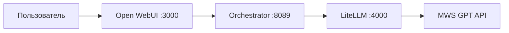

<p align="center">
  
</p>

# SCANOVICH

**Ваши модели. Ваша база знаний. Ваш периметр.**

То, что обычно берут как облачную подписку (OpenAI, Claude и аналоги), здесь собирается **как свой продукт**: тот же привычный чат-интерфейс, но с подключением **своего** inference (локального или корпоративного) и возможностью **индексировать собственную базу знаний**. Данные не обязаны уходить за пределы компании.

Подходит для бизнеса, где важна **приватность**: медицина, юристы, банки, разработка, добыча и недра — и любая отрасль с чувствительными документами. Open-source каркас, который можно адаптировать под задачу и контур.

**Обложка для соцсетей** (Instagram / RedNote, 1080×1920): [`docs/assets/scanovich-social-cover.png`](docs/assets/scanovich-social-cover.png).

**Коммерческая дорожная карта** (что оставить, что снести, пилот / enterprise / platform):  
[`docs/COMMERCIAL_ROADMAP_RU.md`](docs/COMMERCIAL_ROADMAP_RU.md) — точка входа для заказчиков и для доработки продукта «спустя квартал».

---

## Откуда вырос проект

Практический тренажёр и рабочий стенд по кейсу **«GPTHub: единое окно для всех ИИ-задач»** (платформа MWS GPT): один чат в **Open WebUI** для текста, голоса, файлов, картинок и инструментов, с **автоматическим и ручным** выбором модели, **долгосрочной памятью** и наблюдаемостью маршрутизации. Вызовы LLM/VLM/ASR/embedding и генерации изображений — через **LiteLLM** к upstream API; оркестратор — классификация, смешанный ввод, политика ролей, research, PPTX и т.д.

**Запрос по умолчанию:** пользователь → **Open WebUI** → **orchestrator** → **LiteLLM** → **upstream (MWS GPT / свой контур)**.

Трое в команде — большое спасибо всем: это был хороший практический прогон, который **уже работает** и может быть адаптирован под бизнес и задачи.

---

## Для жюри и экспертов

Что проверять и как это соотносится с типовыми критериями кейса:

| Критерий (суть) | Как закрыто в репозитории |
|-----------------|---------------------------|
| **Полнота сценариев** (мультимодальность, инструменты, опционально deep research / PPTX) | Матрица возможностей и статус строк — **`FEATURE_MATRIX.md`**; живые прогоны — **`docs/LIVE_SMOKE.md`**. |
| **Роутинг и память** | Автоматический выбор модели/роли (`data/model_roles.yaml`, **`docs/MODEL_ROUTING_POLICY.md`**), ручной выбор в UI; **долгосрочная память** (факты, эмбеддинги MWS) — см. строки матрицы про memory. Трассировка: заголовок **`X-GPTHub-Trace`**, логи оркестратора. |
| **UX / цельный продукт** | Один поток в Open WebUI; доп. режимы встроены в тот же чат (не отдельный «второй продукт»). |
| **Локальный запуск** | **`make bootstrap-env`** → секреты в `.env` / `.env.mws.local` → **`docker compose … up -d --build`** (см. Quick Start). Секреты в репозиторий не коммитятся — только примеры. |
| **Артефакты сдачи** | Архитектура — **`ARCHITECTURE.md`**, схемы/экспорт — **`docs/submission/`**, история смоуков — **`docs/LIVE_SMOKE.md`**. |
---

## Стек (Docker)

Один `docker compose` из **`infra/docker-compose.yml`**. Команды из **`Makefile`** подставляют **`--env-file .env`** и **`--env-file .env.mws.local`** из **корня репозитория** (иначе пути `env_file` в YAML и подстановка `OPEN_WEBUI_IMAGE` ломаются).

| Сервис | Образ / сборка | Порт на хосте | Назначение |
|--------|----------------|---------------|------------|
| **open-webui** | `OPEN_WEBUI_IMAGE` (см. `.env`) | **3000** → 8080 в контейнере | UI чата; бэкенд указывает на оркестратор как на OpenAI-совместимый API. |
| **orchestrator** | build `apps/orchestrator/Dockerfile` | **8089** → 8000 | FastAPI: классификация, mixed input, память, PPTX/research и др.; вызовы в LiteLLM. |
| **litellm** | pin `ghcr.io/berriai/litellm@sha256:…` | **4000** | Прокси к MWS; конфиг **`infra/litellm/config.yaml`** (алиасы моделей). |
| **embedding-shim** | build `apps/embedding_shim/Dockerfile` | (внутри сети compose) | Профиль **`rag`**: нормализация эмбеддингов для RAG в WebUI. |

**Сеть:** все сервисы в `gpthub-prod-net`; **том** `open-webui-data` смонтирован в WebUI и **только для чтения** в оркестратор (доступ к загруженным файлам по путям из сообщений).

**Профиль `rag`:** `make docker-reset` и рекомендуемый Quick Start поднимают `--profile rag`, чтобы был **embedding-shim** наряду с основной тройкой.

**Поток данных (упрощённо):**



Часть возможностей WebUI (например STT) может ходить в MWS по переменным окружения контейнера WebUI — см. `infra/docker-compose.yml`.

---

## What This Repo Contains

- `apps/orchestrator/`: FastAPI runtime spine, сценарии чата, тесты.
- `apps/embedding_shim/`: опциональный shim для RAG (профиль `rag`).
- `infra/docker-compose.yml`: связка WebUI, orchestrator, LiteLLM, embedding-shim.
- `infra/litellm/config.yaml`: конфиг алиасов LiteLLM под MWS.
- **`docs/MODEL_ROUTING_POLICY.md`**: политика выбора модели; реестр ролей — `data/model_roles.yaml`.

## Quick Start

**Полный пошаговый гайд (RU):** [`docs/LOCAL_RUN_RU.md`](docs/LOCAL_RUN_RU.md) — два env-файла, профиль `rag`, `make docker-up` / `docker-down`, чек-лист и типовые сбои.

From the repo root, Compose must see **both** `.env` and `.env.mws.local` (paths in `infra/docker-compose.yml` are resolved from the repo root). The Makefile wires this with `--env-file` for each run.

1. **Bootstrap** — create `.env` from `bootstrap.env.example`, `.env.mws.local` from `.env.mws.local.example`, and ensure a non-empty `OPEN_WEBUI_IMAGE` (see `make bootstrap-env` output). Use `BOOTSTRAP_FORCE=1` to overwrite existing env files.

   ```bash
   make bootstrap-env
   ```

2. **Secrets** — edit `.env` and `.env.mws.local` (replace placeholders: MWS base/key, `LITELLM_MASTER_KEY` / `ORCHESTRATOR_API_KEY`, optional Tavily, etc.). Full annotated list: `.env.example`.

3. **First start** (build images; includes optional RAG services via `rag` profile — same as Makefile targets):

   ```bash
   docker compose --env-file .env --env-file .env.mws.local -f infra/docker-compose.yml --profile rag up -d --build
   ```

   Or copy the one-liner printed at the end of `make bootstrap-env`.

4. **Later** — быстрый перезапуск **без** пересборки образов: `make docker-reset` (это `docker-down` по сути + `up -d` без `--build`). После **смены кода** оркестратора: `make docker-rebuild` / `make docker-up` (с `--build`).

If `ORCHESTRATOR_API_KEY` is set in your shell to an old value, it can override `.env` when running ad-hoc scripts; for `make demo` the Makefile reads the key from `.env` first. Use `unset ORCHESTRATOR_API_KEY` if in doubt.

**Smoke:** `make demo` или `scripts/demo.sh` (см. Makefile).

Run orchestrator tests locally with dev dependencies:

```bash
cd apps/orchestrator
uv sync --extra dev
uv run pytest -q
```

**PPTX plan model benchmark** (live LiteLLM + MWS; compare `gpt-hub-strong` vs optional instruct aliases):

```bash
# Stack up (same env files as Quick Start):
docker compose --env-file .env --env-file .env.mws.local -f infra/docker-compose.yml --profile rag up -d --build
cd apps/orchestrator && uv sync --extra dev && uv run python ../../scripts/bench_pptx_plan_models.py --repeat 3
```

**URLs:** Open WebUI `http://localhost:3000`, LiteLLM `http://localhost:4000`, orchestrator health `http://localhost:8089/healthz`.

## Demo Lock

The demo flow is deliberately narrow:

1. User sends one chat request in Open WebUI.
2. The request reaches the orchestrator through the OpenAI-compatible facade.
3. The orchestrator classifies the request, injects mixed-input artifacts when present, applies role/system policy, and calls LiteLLM.
4. LiteLLM forwards to MWS using the vendored alias map.
5. The user sees one answer, while routing evidence stays in logs and `X-GPTHub-Trace`.

The only demo differentiator is `mixed input`: one request can combine text, image, PDF, and audio-derived context without introducing extra product modes.

Optional `rag` support is infrastructure for Open WebUI, not a second flagship product mode. The same applies to `CODE_ROUTE_PREFERENCE`: it changes prompt flavor, not the core architecture path.

## Текущее состояние (финальная версия)

**Автотесты:** в `apps/orchestrator` ориентир **~244** тестовых функций в `tests/` (подсчёт по `def test_` / `async def test_`); итог `uv run pytest` может отличаться из‑за skip/xfail. История и снимки (**226+**, **261** passed и т.д.) — **`CHANGELOG.md`**, §Validation.

Ниже — сводка для экспертов по **закрытию кейса**; нумерация строк — **`FEATURE_MATRIX.md`** (источник правды для xlsx сдачи).

### Базовый чат и формат ответа

- Текстовый диалог через фасад оркестратора (1).
- Корректное отображение **Markdown** и блоков кода в WebUI (12).

### Мультимодальность и вложения

- Маршрутизация **изображений** к VLM (5).
- **Аудио:** распознавание речи через MWS (например `whisper-medium`) (4).
- **Генерация изображений** в чате (short-circuit к MWS `/images/generations`, алиас вроде `qwen-image`) (3).
- **Файлы и ссылки:** PDF, Office (**DOCX/XLSX/PPTX** и др. через markitdown), множество текстовых форматов, аудио; загрузка контента по **URL** с защитой от SSRF (6, 8).
- Смешанный ввод в одном сообщении (сценарий **Demo Lock** выше).

### Роутинг моделей

- **Автоматический** и **ручной** выбор модели через цепочку алиасов LiteLLM и политику ролей — `data/model_roles.yaml`, **`docs/MODEL_ROUTING_POLICY.md`** (10, 11).

### Долгосрочная память

- Хранение фактов, эмбеддинги MWS, команды «запомни / забудь / что помнишь» (9).

### Инструменты и расширенные сценарии

- **Веб-поиск:** Tavily через Open WebUI при `ENABLE_WEB_SEARCH=true` и ключе (7). При **`BYPASS_WEB_SEARCH_EMBEDDING_AND_RETRIEVAL=true`** панель **Sources** в UI может расходиться с фрагментами в теле ответа — см. матрицу и **`docs/LIVE_SMOKE.md`**.
- **Deep research / совет экспертов:** триггеры вроде `/research`, «глубокое исследование»; параллельные ветки (generalist / reasoning / doc) и синтез сильной моделью; один ответ пользователю в структурированном виде (13). Свежие прогоны — **`docs/LIVE_SMOKE.md`**.
- **PPTX (WOW-3):** `task_type=pptx`, план слайдов через LLM, сборка **`python-pptx`**, превью и **`GET /artifacts/pptx/{id}?token=…`**; бенч плановых алиасов — `scripts/bench_pptx_plan_models.py`; пакет тестов `tests/pptx_tests/` (14).

### Голос и RAG

- **Голос:** STT/TTS на стороне Open WebUI (2, управление через UI).
- **RAG:** профиль **`rag`** в compose и сервис **embedding-shim** — инфраструктура для WebUI, не отдельный продуктовый режим.

### Наблюдаемость

- Заголовок **`X-GPTHub-Trace`**, логи маршрутизации, fallback и ingest (15).

### Что смотреть при приёмке

- Пошаговые смоки и журнал стенда — **`docs/LIVE_SMOKE.md`**.
- Пробелы, фазы, kill switches — **`ROADMAP.md`** (раздел 0).
- Детализация по фичам и статус строк — **`FEATURE_MATRIX.md`**.
- Снимок имён моделей MWS — **`docs/MWS_CATALOG.md`**.

## Авторы

- **Aleksandr Mordvinov** — Owner, organisation. WOW-1 Expert Council, поставка web-search Tavily, markitdown-ingest Office, лимиты веб-поиска и обход встроенного RAG WebUI для загрузок, синхронизация roadmap / `FEATURE_MATRIX.md` / handoff. GitHub: [@FUYOH666](https://github.com/FUYOH666)
- **Usatov Pavel** — developer. PPTX (план, шаблоны, аудитория), мост статусов Open WebUI, семантический классификатор и политика ingest (общий том загрузок с WebUI), compose/STT через MWS, Makefile, записи в `docs/LIVE_SMOKE.md`. GitHub: [@UsatovPavel](https://github.com/UsatovPavel)
- **Aleksandr Mazurenko** — ручное UI-тестирование

Полный список и правки — [`AUTHORS.md`](AUTHORS.md).

## Документация и материалы

- **`docs/COMMERCIAL_ROADMAP_RU.md`** — коммерческая стратегия и целевая архитектура (для бизнеса / next)
- `docs/NEW_CHAT_HANDOFF_RU.md` — handoff для нового чата
- `docs/TEAM_BRIEF_RU.md` — командный бриф
- `ARCHITECTURE.md` — архитектура
- `ROADMAP.md` — §0.4 (план), 0.5 (kill switches), 0.6 (чеклист)
- `FEATURE_MATRIX.md` — матрица фич для xlsx сдачи
- `docs/LIVE_SMOKE.md` — журнал прогонов через Docker-стек
- `docs/STUDY_PATH_RU.md` — чеклист изучения репо (фазы A–C) + текст для сабмисона
- `docs/submission/` — экспорт xlsx, **PDF архитектуры** (текст + Mermaid без PNG), **презентация** (`SLIDES_10_RU.md` → `GPTHub_defence_10slides.pptx` → PDF); локальный стек — [`docs/LOCAL_RUN_RU.md`](docs/LOCAL_RUN_RU.md)
- `docs/MWS_CATALOG.md` — каталог моделей MWS
- `docs/PROMPT_PRECEDENCE.md`, `docs/WEBUI_PAYLOAD.md`
- `scripts/demo.sh` — идемпотентный curl-smoke (Demo Lock)
- `CHANGELOG.md`

Условие задачи GPTHub и ответы экспертов (если клонировано дерево хакатона **`MTS_hackaton`**): **`../../ресурсы/GPTHub.md`** от корня этого репозитория (`playground/task-repo`).
