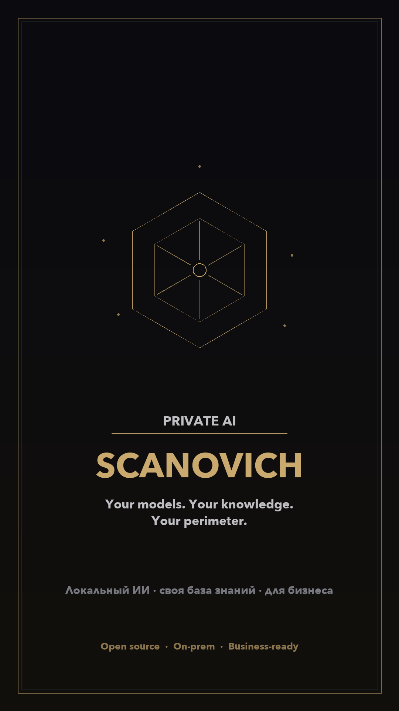
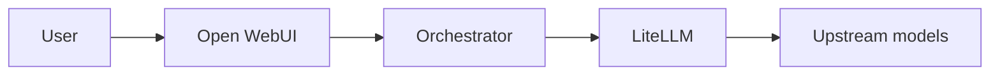

<p align="center">
  
</p>

# SCANOVICH

**Your models. Your knowledge. Your perimeter.**

Open-source scaffold for a **private AI workspace**: chat UX, your own inference
(on-prem / VPC / chosen API), and a path to ground answers in **company documents**
without sending the whole corpus to a public SaaS by default.

Built for industries where privacy matters — healthcare, legal, finance, software,
resources, and any org with sensitive files.

| | |
|---|---|
| Business one-pager | [`docs/FOR_BUSINESS_RU.md`](docs/FOR_BUSINESS_RU.md) |
| Social cover (1080×1920) | [`docs/assets/scanovich-social-cover.png`](docs/assets/scanovich-social-cover.png) |
| Features | [`FEATURE_MATRIX.md`](FEATURE_MATRIX.md) |
| Architecture | [`ARCHITECTURE.md`](ARCHITECTURE.md) |
| Local run (RU) | [`docs/LOCAL_RUN_RU.md`](docs/LOCAL_RUN_RU.md) |
| Authors | [`AUTHORS.md`](AUTHORS.md) |

> **Status:** working prototype / reference stack. Not a turnkey enterprise product
> out of the box (no multi-tenant SSO, no full knowledge-plane ACL yet). Suitable
> as a foundation for a private deployment or a paid pilot.

---

## Request path

**User → Open WebUI → orchestrator → LiteLLM → upstream models**

The orchestrator owns classification, mixed-input ingest (PDF / Office / URL / audio / images),
optional long-term memory, research and PPTX short-circuits, and `X-GPTHub-Trace`.

---

## Stack (Docker)

One compose file: [`infra/docker-compose.yml`](infra/docker-compose.yml).  
Makefile targets pass `--env-file .env` and `--env-file .env.mws.local` from the **repo root**.

| Service | Role | Host port |
|---------|------|-----------|
| **open-webui** | Chat UI (`OPEN_WEBUI_IMAGE`) | 3000 |
| **orchestrator** | Policy spine (FastAPI) | 8089 |
| **litellm** | Model gateway / aliases | 4000 |
| **embedding-shim** | Optional (`--profile rag`) | internal |



---

## Quick Start

1. Bootstrap env files:

   ```bash
   make bootstrap-env
   ```

2. Edit `.env` and `.env.mws.local` — replace placeholders (API keys, shared secrets).  
   Templates: `.env.example`, `.env.mws.local.example`, `bootstrap.env.example`.

3. Start (with optional RAG profile):

   ```bash
   make docker-up
   ```

4. Open WebUI: `http://localhost:3000` · health: `http://localhost:8089/healthz`

5. Smoke (optional): `make demo` (requires `ORCHESTRATOR_API_KEY` / key from `.env`).

Orchestrator tests:

```bash
cd apps/orchestrator && uv sync --extra dev && uv run pytest -q
```

Secrets are never committed — see [`docs/REPO_HYGIENE.md`](docs/REPO_HYGIENE.md).

---

## What this repo contains

- `apps/orchestrator/` — runtime spine + tests  
- `apps/embedding_shim/` — optional embedding adapter  
- `infra/` — compose + LiteLLM config  
- `docs/submission/` — architecture / feature export samples  
- `scripts/demo.sh` — curl smoke  

Open WebUI is consumed as a **container image** (`OPEN_WEBUI_IMAGE`), not as a
vendored source tree in this repository.

---

## Origins

Practical build around the «unified AI window» hackathon case (MWS GPT and similar
OpenAI-compatible upstreams). Three people shipped a working trainer — thank you
to everyone listed in [`AUTHORS.md`](AUTHORS.md). The same spine can be adapted
to other businesses and private model hosts.

---

## License & contributing

See repository license (if present) and [`docs/REPO_HYGIENE.md`](docs/REPO_HYGIENE.md)
before opening PRs. Do not commit secrets or internal ops journals.
