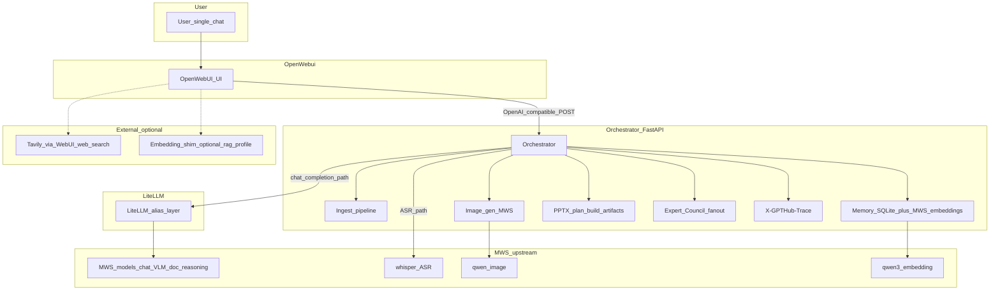
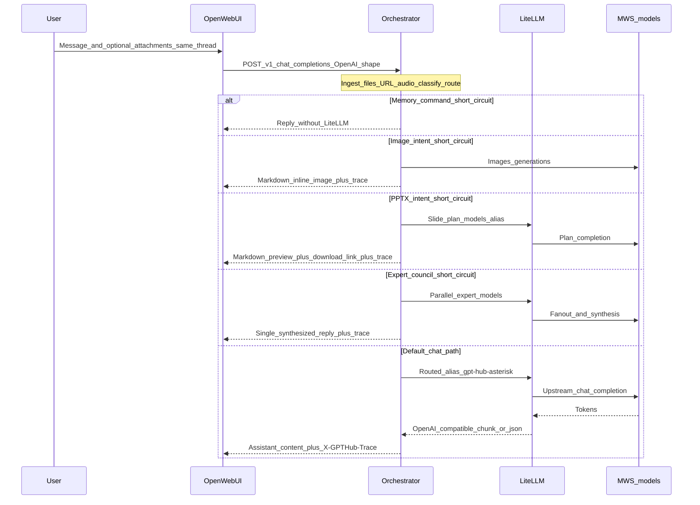

# GPTHub Prod — архитектура и User Flow (машиночитаемая версия для ИИ)

Этот файл **UTF-8 Markdown** — зеркало для репозитория и RAG. **Файл сдачи**
[`GPTHub_architecture_submission.pdf`](GPTHub_architecture_submission.pdf) —
**текстовый PDF** (ReportLab): кириллица + мета `MachineReadableMeta` + полный
Mermaid из `architecture.mmd` и `user_flow.mmd` **внутри PDF**, **без** встроенных
PNG. ИИ и человек читают схемы как текст.

Если форма допускает только один PDF — **загружайте его**; этот `.md` не обязателен.

При правках [`architecture.mmd`](architecture.mmd) / [`user_flow.mmd`](user_flow.mmd)
обновите соответствующие fenced-блоки `mermaid` ниже (или держите канон только в
`.mmd` и генерируйте этот файл скриптом — пока копия вручную).

---

## Сопроводительный текст (как в ARCHITECTURE_SUBMISSION_RU.txt)

Продукт: один чат в Open WebUI; сценарии (текст, файлы, картинка, аудио, URL, голос через STT/TTS UI, веб-поиск при включении, WOW: совет моделей, WOW: PPTX) идут в один OpenAI-совместимый запрос к orchestrator, без второго флагманского режима.

Контур сервисов: Open WebUI → orchestrator (FastAPI: ingest, classifier/router, memory, council, image-gen, PPTX, trace) → LiteLLM (алиасы) → MWS (upstream чат/VLM/doc/reasoning). Наблюдаемость: заголовок X-GPTHub-Trace.

Модели (см. infra/litellm/config.yaml, docs/MWS_CATALOG.md): baseline mws-gpt-alpha (gpt-hub-turbo), тяжёлый glm-4.6-357b (gpt-hub-strong), документный qwen2.5-72b-instruct (gpt-hub-doc), код/рассуждения qwen3-coder-480b-a35b (gpt-hub-reasoning-or), VLM-цепочка qwen3-vl-* / qwen2.5-vl* / cotype-pro-vl-32b, fallback gemma-3-27b-it; image-gen — qwen-image (MWS /v1/images/generations); ASR — whisper-medium; память — qwen3-embedding-8b; план PPTX — алиасы gpt-hub-pptx-* и др.

Внешние зависимости: MWS (API, .env / .env.mws.local); Docker Compose; SQLite для фактов памяти; опционально Tavily (WebUI web search, ENABLE_WEB_SEARCH, TAVILY_API_KEY, bypass эмбеддинга сниппетов); markitdown для DOCX/XLSX/PPTX ingest; опционально embedding shim (профиль rag). Без MWS основной чат не работает.

Исходники диаграмм (Mermaid): docs/submission/architecture.mmd, docs/submission/user_flow.mmd. Рендер: mmdc (пакет @mermaid-js/mermaid-cli).

---

## Схема 1 — контур сервисов (текстовый пересказ для ИИ без vision)

- Узлы верхнего уровня: **User** → **OpenWebUI** → **Orchestrator** (центральный блок).
- Внутри оркестратора: **Ingest_pipeline**, **Memory** (SQLite + эмбеддинги MWS), **Image_gen** (MWS), **PPTX** (план, сборка, артефакты), **Expert_Council** (fan-out), **X-GPTHub-Trace**.
- Основной путь чата: **Orchestrator** → **LiteLLM** (слой алиасов) → **MWS** (чат, VLM, doc, reasoning).
- Отдельные стрелки: оркестратор → **whisper_ASR** (MWS); **Image_gen** → **qwen_image** (MWS); **Memory** → **qwen3_embedding** (MWS).
- Пунктир из **OpenWebUI**: опционально **Tavily** (веб-поиск через UI) и **Embedding_shim** (профиль rag).

### Схема 1 — исходник Mermaid (копия architecture.mmd)

---

## Схема 2 — User Flow (текстовый пересказ для ИИ без vision)

- Пользователь и вложения в **одном** треде WebUI → **POST /v1/chat/completions** в форме OpenAI → **Orchestrator**.
- После ingest/classify/route оркестратор выбирает ветку:
  - **Memory_command**: ответ без LiteLLM;
  - **Image_intent**: MWS images/generations → markdown с картинкой + trace;
  - **PPTX_intent**: план через LiteLLM/MWS → превью + ссылка на скачивание + trace;
  - **Expert_council**: параллельные эксперты через LiteLLM/MWS → один синтез + trace;
  - **Default_chat**: маршрутизированный алиас → LiteLLM → MWS → поток токенов → ответ + **X-GPTHub-Trace**.

### Схема 2 — исходник Mermaid (копия user_flow.mmd)

---

## Примечание

Канон схем — `.mmd` в этой папке; PDF дублирует их как текст. Визуальный PNG для
слайдов — отдельно (`mmdc`). Пересборка PDF: [`docs/submission/README.md`](README.md).
